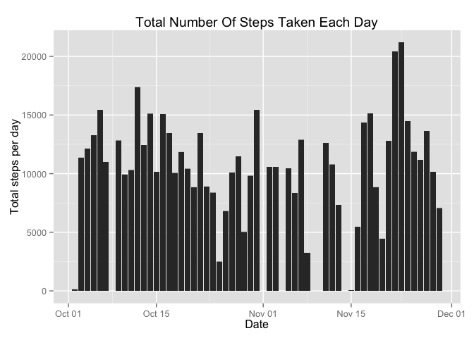

# Reproducible Research: Peer Assessment 1


## Loading and preprocessing the data

```r
act_data <- read.csv("activity.csv")
# open libraries
library(plyr)
library(ggplot2)
library(scales)
# pre-processing
# total step per day
steps_day <- ddply(act_data, .(date), summarise, sum.steps = sum(steps), na.rm = TRUE)
```


## What is mean total number of steps taken per day?
1.1 Make a histogram of the total number of steps taken each day.


```r
act_data$date <- as.Date(act_data$date)
act_data$steps <- as.double(act_data$steps)
qplot(act_data$date, y=act_data$steps, geom="histogram", binwidth = 61, stat="identity",
      xlab = "Date", ylab = "Total steps per day", 
      main = "Total Number Of Steps Taken Each Day")
```

```
## Warning: Removed 2304 rows containing missing values (position_stack).
```

 

Mean steps per day

```r
mean(steps_day$sum.steps, na.rm = TRUE)
```

```
## [1] 10766
```

Median steps per day

```r
median(steps_day$sum.steps, na.rm = TRUE)
```

```
## [1] 10765
```

## What is the average daily activity pattern?


## Imputing missing values


## Are there differences in activity patterns between weekdays and weekends?
