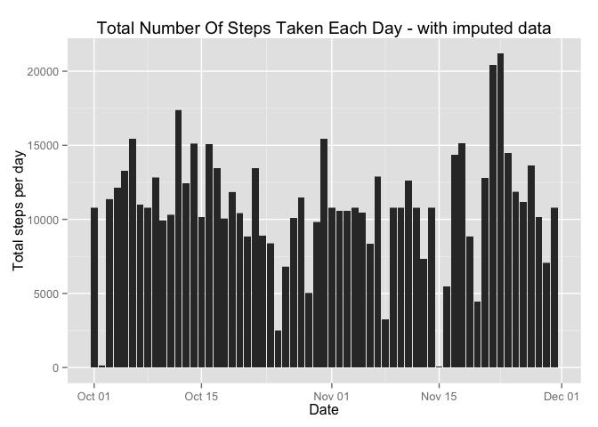
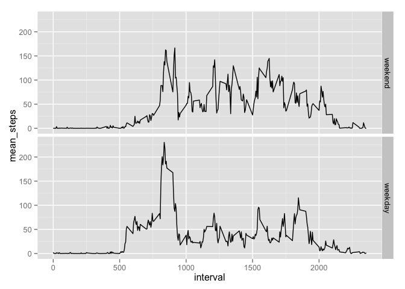

# Reproducible Research: Peer Assessment 1


## 0. Loading and preprocessing the data

```r
# reading the file
act_data <- read.csv("activity.csv")
# open libraries
library(plyr)
library(ggplot2)
library(scales)
library(reshape)
```

```
## 
## Attaching package: 'reshape'
## 
## The following objects are masked from 'package:plyr':
## 
##     rename, round_any
```

```r
# pre-processing
# total steps per day
steps_day <- ddply(act_data, .(date), summarise, sum.steps = sum(steps, na.rm = TRUE))
# mean steps per five minute interval across all days
steps_int <- ddply(act_data, .(interval), summarise, mean_steps = mean(steps, na.rm = TRUE))
```


## 1. What is mean total number of steps taken per day?
### 1.1 Make a histogram of the total number of steps taken each day.


```r
act_data$date <- as.Date(act_data$date)
act_data$steps <- as.double(act_data$steps)
qplot(act_data$date, y=act_data$steps, geom="histogram", binwidth = 61, stat="identity",
      xlab = "Date", ylab = "Total steps per day", 
      main = "Total Number Of Steps Taken Each Day")
```

```
## Warning: Removed 2304 rows containing missing values (position_stack).
```

 

### 1.2 Calculate the mean and median total number of steps taken per day


```r
mean_steps_day <- mean(steps_day$sum.steps, na.rm = TRUE)
mean_steps_day_i <- as.integer(mean_steps_day)
median_steps_day <- median(steps_day$sum.steps, na.rm = TRUE)
median_steps_day_i <- as.integer(median_steps_day)
```

The mean of the total number of steps per day is 9354. And the median of the total number of steps per day is 10395.

## 2. What is the average daily activity pattern?
### 2.1 A time series plot (type = "l" ) of the 5-minute interval (x-axis) and the average number of steps taken, averaged across all days.


```r
# plot of average steps per interval
plot(steps_int$interval, steps_int$mean_steps, type = "l",
     main = "Average Daily Activity Pattern",
     xlab = "Five minute intervals in 24 hours of the day",
     ylab = "Average number of steps")
```

 

### 2.2 Which 5-minute interval contains the maximum number of steps?

Which 5-minute interval, on average across all the days (y-axis) in the dataset, contains the maximum number of steps?

```r
max_int <- steps_int$interval[which.max(steps_int$mean_steps)]
max_step_int <- steps_int$mean_steps[which.max(steps_int$mean_steps)]
max_step_int_i <- as.integer(max_step_int)
```

So interval 835 has the highest average number of steps amounting to 206.


## 3. Imputing missing values
### 3.1 Number of missing values

```r
missing_data <- act_data[!complete.cases(act_data),]
missing_tot <- nrow(missing_data)
```
In the original dataset there are 2304 rows with the value missing for the number of steps in an interval.

### 3.2 Filling missing values
Missing values will be filled with the mean number of steps of the respective 5-minute interval according to the actual data.

```r
# 3.2 steps to replace NA's with mean for the 5 minute interval apart from NAs
# make a wide version of the actual dataset
act_data_wide <- cast(act_data, date ~ interval, value = "steps")
# calculate avererage per interval
int_mean <- vector("numeric", length = 288)
for (i in 2:289) {
        int_mean[i-1] <- mean(act_data_wide[,i], na.rm = TRUE)       
}
for (i in 2:289) {
        for (j in 1:61) {
                if (is.na(act_data_wide[j,i]) == TRUE) {
                        act_data_wide[j,i] <- int_mean[i-1]
                }
        }
}
```

### 3.3 New dataset
A new dataset is created with the missing values filled.

```r
# 3.3 create new data set without NAs from the wide version
act_data_no_na <- melt(act_data_wide, id = c("date", "interval"))
names(act_data_no_na) <- c("date","steps","interval")
act_data_no_na$date <- as.character(act_data_no_na$date) 
act_data_no_na_ord <- act_data_no_na[order(act_data_no_na$date, 
                                           act_data_no_na$interval),]
act_data_no_na_ord$date <- as.Date(act_data_no_na_ord$date)  
```

### 3.4 Compare results with original
Make a histogram of the total number of steps per day with the imputed data included.

```r
# 3.4 Make a histogram of the total number of steps taken each day and
qplot(act_data_no_na_ord$date, y=act_data_no_na_ord$steps, geom="histogram", 
      binwidth = 61, stat="identity",
      xlab = "Date", ylab = "Total steps per day", 
      main = "Total Number Of Steps Taken Each Day - with imputed data")
```

 


```r
# mean, median number of steps per day with imputed data
# total steps per day
steps_day_no_na <- ddply(act_data_no_na, .(date), summarise, 
                         sum.steps = sum(steps))
# mean steps per five minute interval across all days
steps_int_no_na <- ddply(act_data_no_na, .(interval), summarise, 
                         mean_steps = mean(steps))
#
mean_steps_day_no_na <- mean(steps_day_no_na$sum.steps, na.rm = TRUE)
mean_steps_day_no_na_i <- as.integer(mean_steps_day_no_na)
median_steps_day_no_na <- median(steps_day_no_na$sum.steps, na.rm = TRUE)
median_steps_day_no_na_i <- as.integer(median_steps_day_no_na)
# increase in the mean
steps_inc <- median_steps_day_no_na_i - mean_steps_day_i
```

The mean of the total number of steps per day with imputed data is 10766 compared to 9354 in the original data. That is an increase of 1412.

The median of the total number of steps per day with imputed data is 10766 compared to 10395in the original data.


## 4. Are there differences in activity patterns between weekdays and weekends?
### 4.1 Create 'weekday' 'weekend' factor
A new factor variable is created in the dataset of average steps per interval with two levels – “weekday” and “weekend” indicating whether a given date is a weekday or weekend day.

```r
# Q4 weekdays factor added to actual data with imputed data
act_weekdays <- weekdays(act_data_no_na_ord$date)
for (i in 1:17568) {
        if (act_weekdays[i] == "Saturday" | act_weekdays[i] == "Sunday") {
                act_weekdays[i] <- "weekend"
        } else {act_weekdays[i] <- "weekday"                
        }
}
act_weekdays <- as.factor(act_weekdays)
act_data_no_na_ord <- cbind(act_data_no_na_ord, act_weekdays)
#
act_data_weekend <- subset(act_data_no_na_ord, act_weekdays == "weekend")
act_data_weekday <- subset(act_data_no_na_ord, act_weekdays == "weekday")
#
steps_int_weekend <- ddply(act_data_weekend, .(interval), summarise,
                           mean_steps = mean(steps))
steps_int_weekday <- ddply(act_data_weekday, .(interval), summarise,
                           mean_steps = mean(steps))
#
we_factor <- c(1:288)
we_factor <- as.character(we_factor)
for (i in 1:288) we_factor[i] <- "weekend"
steps_int_weekend <- cbind(steps_int_weekend, we_factor)
for (i in 1:288) we_factor[i] <- "weekday"
steps_int_weekday <- cbind(steps_int_weekday, we_factor)
steps_int_week_end_day <- rbind(steps_int_weekend, steps_int_weekday)
```

### 4.2 Panel plot
This plot compares average activity in the weekend with weekdays. It shows that activity is slower to start in the weekend but peaks at around the same time as on weekdays (about interval 835). And for the rest of the day activity levels are higher in the weekend and drop towards zero later.


```r
qplot(interval, mean_steps, data = steps_int_week_end_day, 
       geom = "line", facets = we_factor ~.)
```

 


